# Modmixer

*This project was developed in 2022 as part of the Integrative Project II at the Federal University of Santa Catarina, Joinville Technological Campus.*

Unfortunately, for this reason, many information are in Portuguese (code and diagrams). 
Feel free to reach out in case of interest or doubts, we would love to help.


## Contributors
- **Gabriel Cesar Silveira** - Graphical Interface
- **[Guilherme Turatto](https://github.com/guilhermeturatto)** - Embedded software and Hardware

----

## About the Project

**Modmixer** is a low-cost modular sound controller designed for Linux applications. This project covers hardware development, embedded software, and a graphical interface to provide seamless volume control for multiple applications on your desktop. The hardware and embedded software are based on ESP8266 microcontroller and allows plug-and-play of multiple control modules. Also, the interface allows the assingment of the modules based on the running applications.

<p align="center">
  <div style="display: inline-block; text-align: center; margin: 0 10px;">
    <br/>
    <b>Test Circuit</b>
  </div>
  
  <div style="display: inline-block; text-align: center; margin: 0 10px;">
    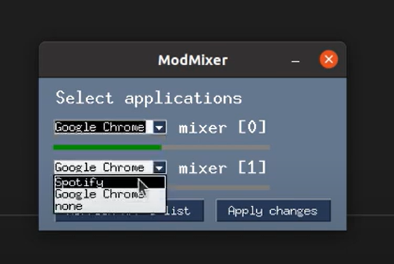<br/>
    <b>Main Screen</b>
  </div>

  <div style="display: inline-block; text-align: center; margin: 0 10px;">
    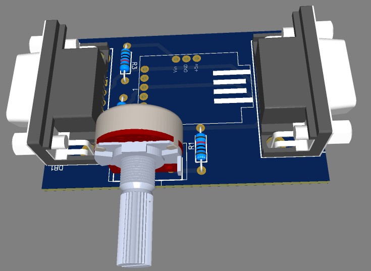<br/>
    <b>Module</b>
  </div>
</p>


## Table of Contents
- [Features](#features)
- [Getting Started](#getting-started)
  - [Prerequisites](#prerequisites)
  - [Installation](#installation)
- [Usage](#usage)
- [Project Structure](#project-structure)
- [Technical Details](#technical-details)
- [Diagrams](#diagrams)
- [Testing](#testing)
- [Known Issues](#known-issues)
- [Contributors](#contributors)
- [License](#license)


## Features
- **Graphical Interface**: Easily assign applications to modules.
- **Modular Control**: Increase or decrease the volume of specific applications.
- **Plug and Play**: Automatic recognition of modules upon connection.
- **Scalability**: Supports varying numbers of modules.
- **Single USB Connection**: All data transmitted via one USB port.

## Getting Started

### Prerequisites
- **Operating System**: Linux (tested on Ubuntu 20.04 LTS)
- **Hardware**: ESP8266 module ESP-01, USB adapter for ESP-01
- **Software Dependencies**: Listed in `requirements.txt`

### Installation
1. Clone the repository:
   ```bash
   git clone https://github.com/yourusername/modmixer.git
   cd modmixer
   ```
2. Install the required Python packages:
   ```bash
   pip install -r requirements.txt
   ```
3. Connect the main module to your USB port.

## Usage
Run the interface using:
```bash
python main.py
```
The system will detect connected modules and allow application assignment through the GUI.

## Project Structure
- **Interface Gráfica**: Developed with PySimpleGUI.
- **Comunicacão Serial**: Manages communication between modules and the computer via USB.
- **Eletroônica e Montagem**: Assembled using ESP8266 modules and custom PCBs.
- **Modelagem CAD**: Designed enclosures using additive manufacturing techniques (3D printing with PLA).

## Technical Details

### Functional Requirements
- **RF1**: Possess a graphical interface for configuring hardware modules.
- **RF2**: Users must be able to control the volume of different applications from the modules.
- **RF3**: Plug and play functionality.
- **RF4**: Ensure functionality with different numbers of modules.
- **RF5**: Transmit module information to the computer via a single USB connection.

### Non-Functional Requirements
- **RNF 1.1**: USB port selection box for connecting to the main module.
- **RNF 1.2**: Selection box to link each connected module to the desired application.
- **RNF 1.3**: The number of selection boxes displayed should match the number of connected modules.
- **RNF 1.4**: Display a warning screen if no module is connected.
- **RNF 1.5**: Display a progress bar to indicate the current application volume.
- **RNF 1.6**: Button to terminate the interface execution.
- **RNF 2.1**: The connection sequence of the modules should correspond to the sequence of indices listed vertically in the graphical interface.
- **RNF 2.2**: The potentiometer’s minimum and maximum limits should be translated to the application’s audio levels.
- **RNF 2.3**: Application selection in the interface should only modify the selected application's volume.
- **RNF 3.1**: Define I2C protocol addresses at runtime via auxiliary communication based on the One-Wire protocol.
- **RNF 3.2**: Each module should signal to the main device if there is a subsequent module connected and its address.
- **RNF 3.3**: The main device should store the number of connected devices and their respective addresses.
- **RNF 4.1**: The main device should update the list of connected devices whenever a request is not met twice consecutively.
- **RNF 4.2**: The main module should notify the user interface program whenever there are changes in the list of connected devices.
- **RNF 4.3**: The 3.3V power bus (VCC and GND) and the I2C bus (SCL and SDA) should have a direct path between the modules and the main device.
- **RNF 5**: The main module should contain a USB adapter for the ESP01 microcontroller.
- **RNF 5.1**: Serial communication between the master module and the computer via USB at 9600bps.
- **RNF 5.2**: Communication between the main module and other modules via I2C.
- **RNF 5.3**: The main module should periodically request status (volume) from secondary modules at a maximum interval of 50 milliseconds.
- **RNF 5.4**: The main module should send the status of all modules to the computer periodically at a maximum interval of 100 milliseconds.

### Development Assumptions
- **Operating System**: Linux (Ubuntu 20.04 LTS) with all necessary dependencies installed.
- **Microcontroller**: ESP8266 module ESP-01 for all modules.
- **Connection**: Between the main module and the computer through a USB adapter designed for ESP-01 (ESP01-USB).
- **Module Limits**: 
  - **USB 2.0 (500mA)**: Main module + 4 Modules.
  - **USB 3.0 (900mA)**: Main module + 8 Modules.

### CAD Modeling and Case Printing
- **Initial Fit Tests**: Conducted to optimize the project timeline before final assembly.
- **Design Specifications**: 
  - 2mm thickness for cases for sufficient mechanical strength.
  - Dimensions: 44mm width and 100mm length (later reduced).
- **Material**: PLA for cost-effectiveness and low melting point.
- **Printing Details**: 
  - Initial modules used 51g of material.
  - 7 hours print time per module.
- **Final Adjustments**: Position of potentiometers changed to the top, and a logo was added to the cases.

## Embedded Program

### I2C's Requisition Messages

| **Name**  | **ID**       | **FLAGS**                                | **CHECKSUM**            |
|-----------|--------------|------------------------------------------|-------------------------|
| **Size**       | 1 byte       | 1 byte                                   | 1 byte                  |
| **Range** | 0 - 127     | 0 - 255                                  | 0 - 255                 |
| **Function**        | Own I2C address or new one | Indicates that there are functions to be executed by the module | Verification sum     |

### Requisition Flags

| **Bits**  | **Flag**                           | **Function**                               |
|-----------|------------------------------------|------------------------------------------|
| 7 | setAddrFLAG | Indicates that the module must update the its adress as the one received on ID
| 6 | nextModResetFlag | Indicates that the next module must be reset |

### I2C's Answear Messages

| **Nome**  | **Data**                           | **FLAGS**                                | **CHECKSUM**            |
|-----------|------------------------------------|------------------------------------------|-------------------------|
| **Size**       | 1 byte                            | 1 byte                                   | 1 byte                  |
| **Range** | 0 - 100                           | 0 - 255                                  | 0 - 255                 |
| **Function**        | Analogical read converted   | Indicates functional parameters      | Verification sum     |

### Answear Flags
| **Bits**  | **Flag**                           | **Function**                               |
|-----------|------------------------------------|------------------------------------------|
| 7 | internalFailFLAG | Indicates that the module failed |
| 6 | newModResetedFLAG | Indicates that the next module was reseted |

## Testing

### Interface Testing
1. **Information Capture**: Validates data transmission from modules using Arduino Nano to emulate control signals.
2. **Module Detection**: Ensures GUI updates based on connected modules and tests detection accuracy.
3. **Application Selection**: Verifies correct mapping and volume control for selected applications.
4. **Audio Control**: Confirms the alignment of system audio levels with control signals.
5. **Delay Measurement**: Measures response time from control signal capture to system sound adjustment.

### Serial Communication Testing
1. **Module Detection & Address Assignment**: Ensures proper communication using I2C and correct address allocation.
2. **Message Integrity**: Checks for consistency in message size and checksum validation.
3. **Volume Variation**: Monitors accuracy in volume adjustments.

# Graphical Interface Tests

The graphical interface tests validated several criteria established in RNF1 and RNF2 and were sufficient to ensure the system's functionality.

Due to project delays, the interface was tested using an Arduino Nano, which emulated the control signals of potential modules.

### Information Capture
In this test, the Arduino sends a known sequence of numbers and letters in the following audio control format:
```
[A-Z] [0] [0.00 to 1.00]
```
The messages are captured and compared with the expected values.

- **First Test:** Compares the number of messages received with the expected number to ensure no data loss.
- **Second Test:** Compares the content of the messages to ensure proper capture of letters and values, confirming their use in control signals.

Both test routines achieved 100% accuracy.

### Module Detection
This test verifies that the interface correctly detects and adapts to changes in the number of connected modules.

Messages of increasing size (indicating more connected modules) are received in a known sequence. The number of detected modules and visible menu items are recorded in each iteration and compared to the expected sequence.

- **First Test:** Verifies the number of detected modules.
- **Second Test:** Verifies the number of visible items in the interface menu.

Both test routines achieved 596 correct detections.

### Application Selection
This test validates the listing and selection of applications in the interface menu.

- **First Test:** Verifies that the list of selected applications matches the system’s audio sources in each iteration.
- **Second Test:** Emits a control signal to constantly adjust the volume of a single module. It verifies that the selected application in the interface matches the one with the altered volume in the system.

Both test routines were successful.

### Audio Control Test
Control signals are emitted to adjust the volume of two applications. These signals are captured and saved at each iteration, while system audio levels are also recorded. A visual comparison is made to ensure that audio levels follow the generated control signals over time.

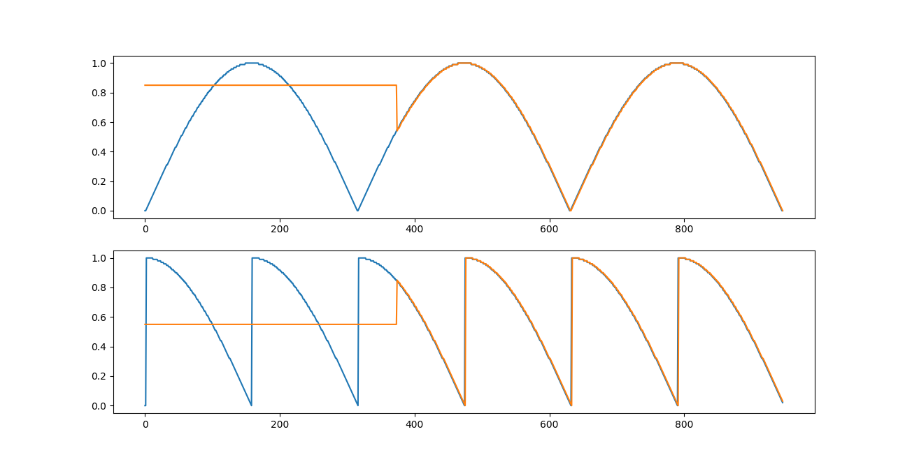

This test is validated by visual inspection. The audio curve (orange) follows the control signal (blue) after a brief delay, confirming the application's assignment in the interface.

### Delay Measurement
The `time` library is used to log timestamps, allowing calculation of time intervals between each code step.

- **First Test:** Measures the average time between the creation of the `Modmixer` object and the first display of the selection menu over 30 interface executions.
- **Second Test:** Measures the average time between capturing the control signal and calling the volume adjustment library function over 30 executions.

Results:
- **Menu display time:** 17.73 seconds
- **Control signal to system action:** 0.02 seconds

# Serial Communication Tests

### Module Detection and Address Assignment
Upon starting the main module, a message is sent to the default I2C address (`0x01`), where all secondary modules initially begin. Each secondary module waits for the previous module to be configured before joining the I2C bus. This access order is ensured through high-level digital signaling cascaded between modules.

After receiving the message at the default address, secondary modules verify the checksum field. If the received value matches the internally calculated sum, the message content is verified. If the flag to set a new address is detected, the module reassigns its I2C address and allows the next module to start with the default address.

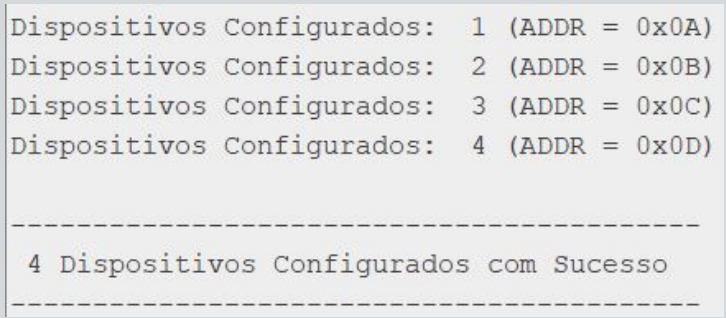

The above figure demonstrates the communication process, showing address assignment with four devices during the main module’s setup phase.

### Message Integrity Test
This test ensures communication integrity with already configured devices and detects errors.

Errors are detected in two ways:
- The number of bytes received differs from the requested number.
- The checksum byte differs from the internally calculated value.

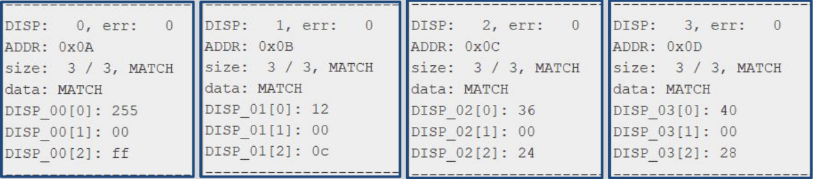

The figure above displays:
- **DISP:** Device number
- **err:** Accumulated communication errors
- **ADDR:** Device address
- **size:** Bytes requested vs. received
- **Verification:** Byte count and checksum validation
- **Message Content:** Contents of each of the three message bytes

Disconnecting a module results in no bytes received, which is detected as a discrepancy between request and response. This scenario is illustrated in the referenced figure.

### Volume Variation Test
Finally, graphs were plotted showing the first byte of each message, representing the module’s volume.

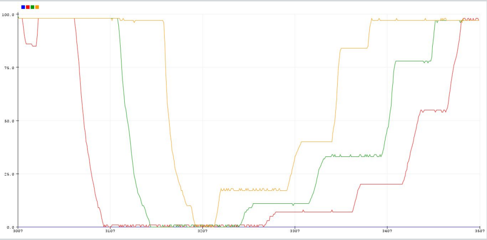

## Issues Encountered
Several challenges during the project led to delays in graphical interface and serial communication development.

- **PySimpleGUI Issues:** The library used for the graphical interface presented unforeseen issues in its documentation examples. Recent updates by the developers altered how interface closure events are handled, splitting them into "intent to close" and "complete closure."
  
- **PySerial Issues:** The `readline` function from the PySerial library, used to collect commands from modules via USB, did not always adhere to the defined timeout. Replacing it with the similar `read_until` function resolved these issues. Additionally, the delay between write and read operations was not documented, leading to communication failures.

# Hardware Implementation

Pictures from the testing setup:


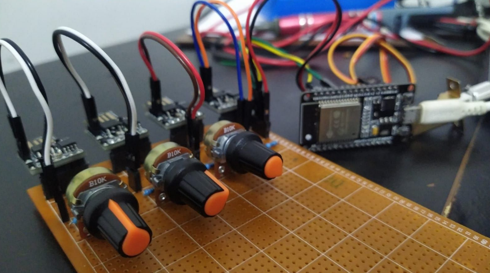


# Diagrams and System Modelling

The following diagrams describe the behavior of the system:

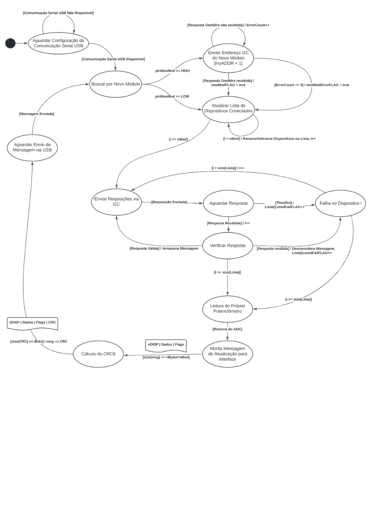
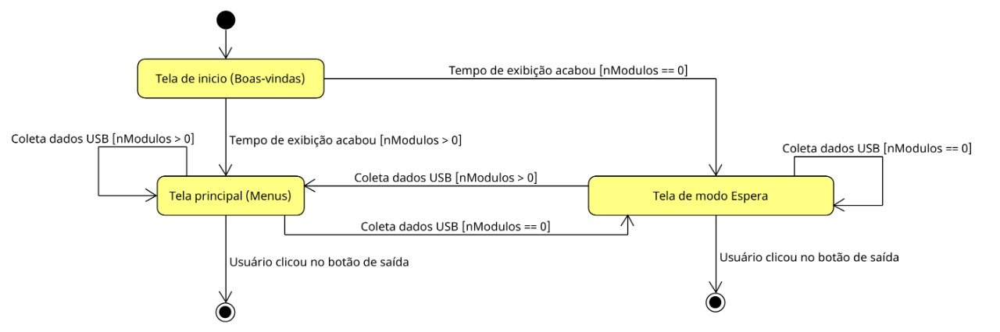
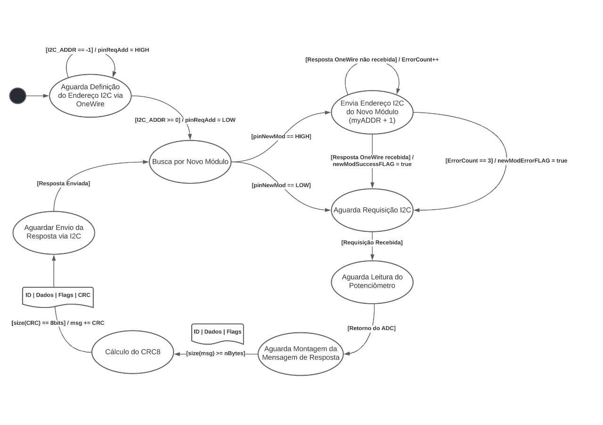
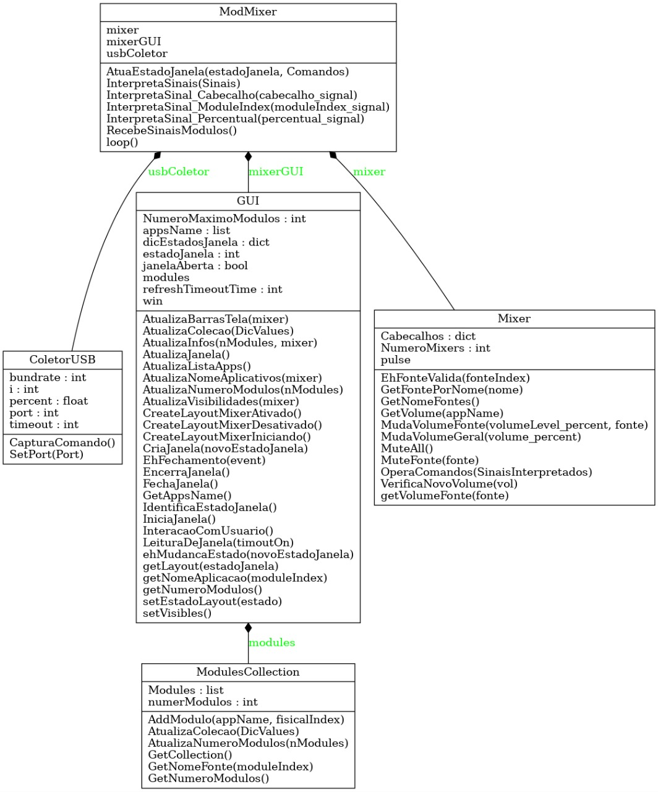
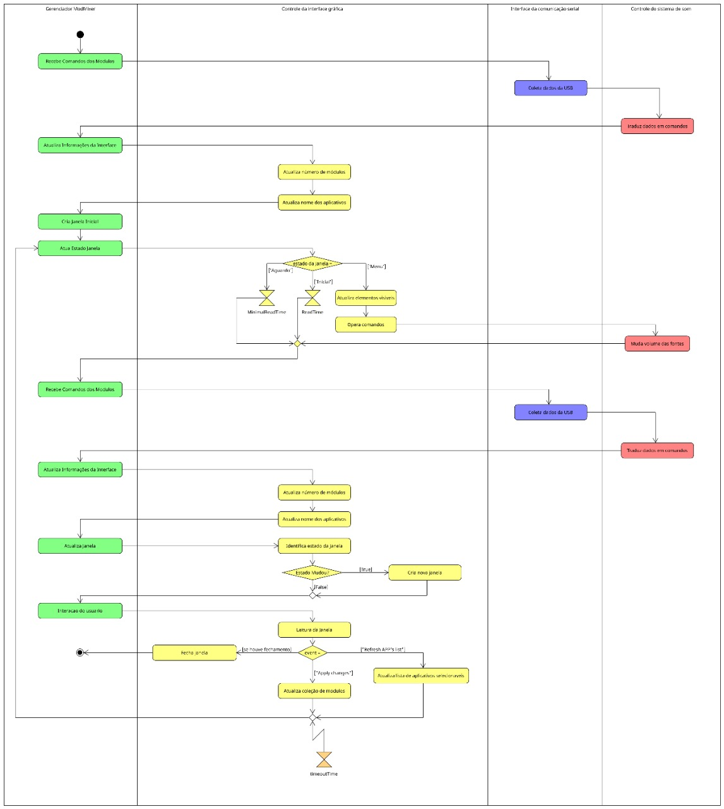


## Known Issues
- **PySimpleGUI Bugs**: Issues with interface closing events due to recent updates. The library's object recently recognize the events of 'closing intention' and the 'closure' itself differently
- **PySerial Readline**: Inconsistent timeout handling when using ''readline'', resolved using `read_until` instead. 
- **Delay Handling**: Lack of documentation on delay between read and write operations caused initial failures.

## Next steps 
- Improvements on hardware documentation of module's and testing setup.

---


